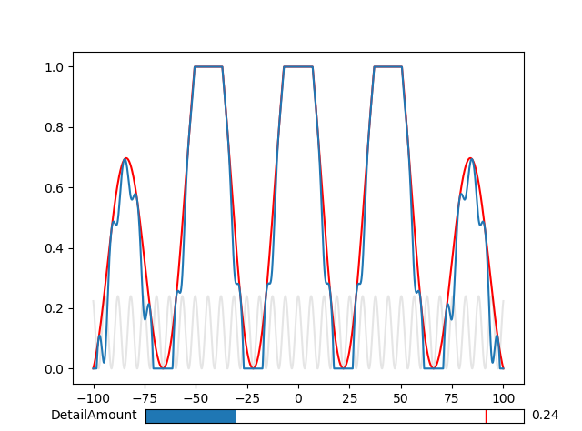
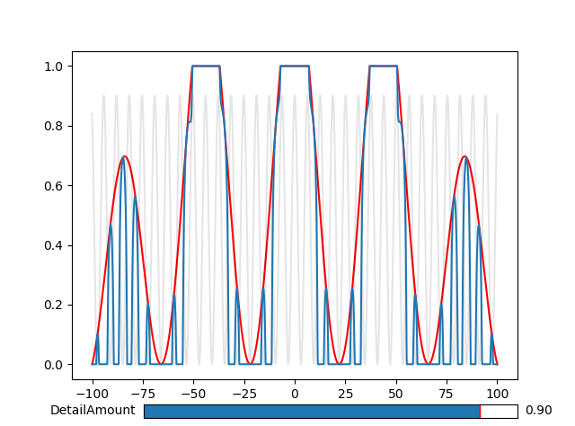

# Cloud Density

## Overview

We want to approximate a fully three-dimensional representation of the density
of the clouds at all points in space.

We can roughly break this up into the five following steps:

*Coverage*
* Determine at what height in the atmosphere we expect to see clouds. We can
parameterize types of clouds based on how high they are found in the atmosphere.
* Determine the horizontal cloud coverage based on a simulation or approximation
of the weather. We will try to expose this as an authorable coverage
texture.

*Local Density*
* Where we do have cloud coverage, determine the rough cloud density that will
achieve the desired cloud shape.
We will wish to parametrize this based on type.
* Determine the detailed cloud density, particularly for evaluating shape and
lighting at the surface.
* Determine the time evolution of the rough and detailed cloud densities.

## Common Operations

### Remap

The Remap function is a simple linear operation used to map a value or set of
values to a new range:
````
Remap(Value, OldMin, OldMax, NewMin, NewMax) = NewMin + (Value - OldMin) * (NewMax - NewMin) / (OldMax - OldMin)
````

In simple usage, while `Value` is a variable, while the old and new min and max
values are taken constant, so Remap just scales and offsets `Value`.

In our usage, one of the range values is also a variable. In this way, we can
use a different noise value to modulate an original noise used in `Value`.

_Example_

Frequently, the Remap function is used to 'trim away' the edges of a base function
through modulation with a higher-frequency detail function:
`Remap(Base, Detail, 1, 0, 1)`. Parts where the base function is close to the
maximum of 1 are unaffected by this remapping, since original values of 1 are
remapped to 1. Parts where the base function are smaller, however, will be
shrunk based on the value of the detail function. Let's visualize this in a
simple 2D example.



With a small detail function (in grey), the base function (in red) is relatively
unchanged when its value is large, and only when its value is small do we see
the remapped result (in blue) responding to the detail function instead.



With a large detail function, the effect is more pronounced. The effect of the
detail function in the remapping is seen when the base function value is small --
namely, at the edges of the peaks.

### Other

TODO - others common operations


## Local Density

### Base Density

We can build on the large body of work that has been done in modelling cloud
density by procedural noise textures. In particular, we will consider the
"Physically Based Sky, Atmosphere and Cloud Rendering in Frostbite" presentation
from SIGGRAPH 2016 Course:
[Physically Based Shading in Theory and Practice](https://blog.selfshadow.com/publications/s2016-shading-course/).

The authors have released a C++ project
[TileableVolumeNoise](https://github.com/sebh/TileableVolumeNoise) that can
help generate the types of tileable, three-dimensional noise textures that can
be used to represent cloud density. We will use my
[fork](https://github.com/TylerDodds/TileableVolumeNoise/tree/feature/premultiplied-alpha),
which ensures that
the default outputs do not have incorrect pre-multiplied alpha processing,
so that all four channels of the texture (RGBA) will be imported into Unity
as expected. These textures are generated as long strips of 2D images, so
we will need additional work to bring them into Unity as `Texture3D`.
See the [NoiseTextures](NoiseTextures/NoiseTextures.md) page for details on how
to process and unpack all four channels of this texture to obtain the base
density.

TODO

### Detail Density

TODO

### Curl Offset

TODO

### Combined Density

TODO

## Cloud Coverage

### Atmosphere

TODO

### Weather

TODO

## Density From Coverage

TODO
