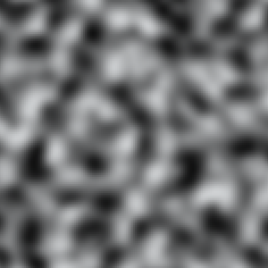
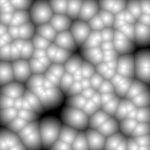
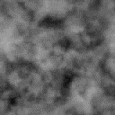

# Noise Textures

## Overview

We will use pre-generated noise textures composed in an easily-configurable way
to a create cloud density field that evolves interestingly over both time and
space.
As discussed in [CloudDensity](../CloudDensity.md), these consist of 3D noise
textures to generate _local_ density by combining a base density with a detail
density, as well as 2D textures to modulate that based on the cloud's horizontal
position.

## Basic Noise types

There are a few basic procedural noise types we will encounter in this project.

### Perlin Noise

[Perlin Noise](https://en.wikipedia.org/wiki/Perlin_noise) refers to
Perlin's original implementation of gradient noise, which aims to build a set
of (pseudo)random gradient vectors specifying how the noise value will change
over space, then smoothly connecting all of them. In practice, it is often
used to refer to any type of
[Simplex Noise](https://en.wikipedia.org/wiki/Simplex_noise), its successor.

To get a feel for working with Perlin noise, check out the
[Book Of Shaders chapter](https://thebookofshaders.com/11/) on it.



### Worley Noise

[Worley Noise](https://en.wikipedia.org/wiki/Worley_noise) is a cellular or
blobby noise, where the noise value is based on the distance to a set of
(pseudo)random 'seed' points.

To get a feel for working with Worley noise, check out the
[Book Of Shaders chapter](https://thebookofshaders.com/12/) on it.



### Curl Noise

Curl noise is a type of noise based on other noise values, usually Simplex noise.
Its purpose is to generate a noise whose components represent a
[divergence-free vector field](https://en.wikipedia.org/wiki/Solenoidal_vector_field).
What this means is that the noise represents the velocity of smoothly flowing
particles without any source or sink of particles. By placing particles at
various places and having their velocity follow the noise values wherever they
end up, you will end up with a smooth flow.

In practice, we do not keep track of these trajectories when using curl noise in
a shader, but by performing small looping displacements, we can still end up with
a convincing flow effect.

Check out this [blog post](http://petewerner.blogspot.com/2015/02/intro-to-curl-noise.html)
and the references therein for more details.

## Cloud Density Noise Textures (3D)

As mentioned in [CloudDensity](../CloudDensity.md),
we will follow this
[fork](https://github.com/TylerDodds/TileableVolumeNoise/tree/feature/premultiplied-alpha),
of the [TileableVolumeNoise](https://github.com/sebh/TileableVolumeNoise)
project. Part of the
[Physically Based Shading in Theory and Practice](https://blog.selfshadow.com/publications/s2016-shading-course/).
SIGGRAPH 2016 course, it is designed to specifically generate the base and
detail noise textures for this type of volumetric clouds.

Additionally, the many
([1](https://www.guerrilla-games.com/read/the-real-time-volumetric-cloudscapes-of-horizon-zero-dawn),
[2](https://www.guerrilla-games.com/read/nubis-authoring-real-time-volumetric-cloudscapes-with-the-decima-engine),
[3](https://www.guerrilla-games.com/read/nubis-realtime-volumetric-cloudscapes-in-a-nutshell))
presentations on Guerrilla Games' Nubis cloud rendering engine contain a
portion regarding the cloud density noise textures.

### Base Density Noise Texture

#### Texture Components

The base density noise for the cloud is called Perlin-Worley noise, and is a
combination of Perlin and Worley noise values. In fact, the final base density
will be build from Perlin-Worley noise and _three additional_ Worley noises,
each of higher frequency.

Instead of the blobby, cell-like Worley noise pictured above, we would like to
retain the character of the noise while adding more detail. We will use the
technique of fractal noise (or _Fractal Brownian Motion_ -- again, see the
[Book Of Shaders page](https://thebookofshaders.com/13/) for more details).
Simply put, this means adding together many types of the same noise, each with
higher frequency, or equivalently, a smaller distance scale.


The resulting noise already looks less synthetic than the original.
We will use this technique for both the Perlin-Worley and Worley noises.

The base Perlin-Worley noise will be used at the lowest frequency to give the
overall shape. It will retain the connectedness of the Perlin noise and the
billowiness of the Worley noise.



However, we will make use of even higher-frequency Worley noise to further
shape our clouds. As a result,
we need to be careful about how we store and represent the noise value.
Most images are represented in RGB(A) format, where each channel is allocated
8 bits (though often in compressed format). There are only 256 possible discrete
color values for each channel, limiting the potential detail, even if your
image texture has a large size.

Increasing the number of bits of the representation will allow for finer
resolution of the store noise values. There are many different texture formats
available in Unity, both as Texture resources, along with the different possible
representations in a shader.

To represent the Worley noise, we will store three separate images, using
increasingly higher frequencies, in three different channels (G, B, and A)
of our noise texture. For the Perlin-Worley noise, it will suffice to use only the R
channel that is remaining. Each of the red, green, blue, and alpha channels
represents a different noise value, which we will recombine later in the shader
into a single noise value.

Since we are trying to create a single-channel noise
texture (that is, we only care about one final value in the end), it would be
natural to consider storing it in that format. For example, a format such as
[RFloat](https://docs.unity3d.com/ScriptReference/TextureFormat.RFloat.html)
has 32-bit (floating point) precision, capable of storing 2^32 = 4,294,967,296
different values. Using only the range from 0 to 1 would still be more than
sufficient. Furthermore, storing only the final value saves on any other operations.
However, we'll perform the unpacking in the shader for added flexibility in
performing the unpacking operation, and increased compatibility using
an [RGBA32](https://docs.unity3d.com/ScriptReference/TextureFormat.RGBA32.html)
format texture.

#### Generating Fractal and Perlin-Worley Noise

Perlin and Worley noise functions each depend not only on the position of the
pixel, but also the _frequency_ of the noise. In most cases you can consider
the frequency directly multiplying the pixel position, equivalent to shrinking
a larger-size noise into the same number of pixels, giving smaller-sized details.

Fractal noise adds smaller and smaller amounts of higher-frequency noises, as
in the following expression:
````
Fractal = A * Noise(p, 1) + A^2 * Noise(p, f) + A^3 * Noise(p, f^2) + ...
````

Common factors are to double the frequency (`f = 2`) and halve the amplitude
(`A = 0.5`) each octave. Eventually the fractal will be cut off one the
frequency becomes too large for the noise to properly represented even between
neighbouring pixels.

The Perlin-Worley noise is obtained by using the _Remap_ function discussed
in further detail in [CloudDensity](../CloudDensity.md).
Refer to the _TileableVolumeNoise_ source for full implementation details.

````
PerlinWorley = Remap(PerlinFractal, 0, 1, WorleyFractal, 1)
````

This means that the base Perlin noise will be remapped to a range where its
minimum is the Worley noise. It will be unchanged when the Worley noise is low,
and will be brightened where the Worley noise is large.

#### Unpacking and Remapping

Now, we take our one Perlin-Worley noise channel and three Worley noise channels,
and wish to combine them to make the final noise.

We'll begin by combining our three individual Worley noise textures into a
high-frequency fractal noise version,
`WorleyHighFrequencies = 0.625*Worley1 + 0.25*Worley2 + 0.125*Worley3`,
where we weight lower-frequency noise with a higher multiplier.

Then, the base density for the noise is given by remapping the Perlin-Worley
channel with the sum of the Worley channels, so that the edges of the
Perlin-Worley noise will gain some of the billowiness of the Worley noises.
````
BaseNoise = Remap(PerlinWorley, WorleyHighFrequencies, 1, 0, 1)
````

In `NoiseTextureUtil.cginc`, the Worley fractal noise is unpacked by the
`UnpackOctaves` function, and the base noise is unpacked by the
`UnpackPerlinWorleyBaseNoise` function. Note that we add an additional
configurable density offset to the Perlin-Worley noise before remapping
with the high-frequency noise.

### Detail Density Noise Textures

The detail noise texture is simply Worley fractal noise. However, since the
detail will operate at smaller scales and will primarily be visible at the edges
of the clouds, it will be a higher-frequency but smaller texture than the
Worley component of the base noise.

We will use the same packing scheme as the Worley components of the base density,
but use the RGB channels only. The alpha channel will be left unused in this
texture.

### Generating and Importing

#### Generating

Open and build the `TileableVolumeNoise.sln` solution file from the
[fork](https://github.com/TylerDodds/TileableVolumeNoise/tree/feature/premultiplied-alpha)
mentioned in [CloudDensity](../CloudDensity.md).
It's easiest to use Visual Studio with C++ features installed
(you can use the Visual Studio Installer to add these if your version of Visual
Studio from the Unity install doesn't include them).

It will write `noiseShape.tga` (base density) and `noiseErosion.tga` (detail
density) textures into the folder where `TileableVolumeNoise.exe` is generated.
The base density image is 16384x128, packing a 128x128x128 3D texture
horizontally. The detail density image is 1024x32, packing a 32x32x32 3D texture
horizontally.

Note that it will also generated packed versions of these noises, where the
unpacking step has already been performed. As mentioned above, we'll perform
the unpacking ourselves.

#### Importing (`TextureSplit.cs`)

We'll need to slice up these textures, and then represent them as a Texture3D
asset within Unity. Without a 3D texture format we can simply import into Unity,
that means we'll need to create the Texture3D ourselves using editor scripting.
As a result, we'll do the slicing within Unity as well.

First, we import `noiseShape.tga` and `noiseErosion.tga` into our Unity project.
We'll set the Format to _RGBA 32 Bit_, turn off _alpha is transparency_, turn
off _generate mipmaps_, turn off sRGB, set read-write enabled,
and set the max size to 4096. We'll note that
`noiseShape.tga` has a width of 16384, larger than what we can select in Unity.
Fortunately, the function `SetMaxSize` can set larger maximum texture sizes, up
to the system maximum. In my case, this was exactly 16384, so I was able to
import the texture at full size by calling this function through
`Tools/Textures/Set Max Size To 16384`.

Next, we'll split each texture using the `SplitSelectedTexture` function through
`Tools/Textures/Split Texture2D To Texture3D Cube`. This leaves us with the
`NoiseShape.asset` and `NoiseErosion.asset` Texture3D assets.

## Cloud Distribution Noise Textures (2D)

TODO
