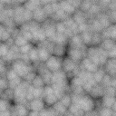
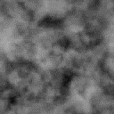

# Noise Textures

## Overview

TODO

## Basic Noise types

There are a few basic procedural noise types we will encounter in this project.

### Perlin Noise

[Perlin Noise](https://en.wikipedia.org/wiki/Perlin_noise) refers to
Perlin's original implementation of gradient noise, which aims to build a set
of (pseudo)random gradient vectors specifying how the noise value will change
over space, then smoothly connecting all of them. In practice, it is often
used to refer to any type of
[Simplex Noise](https://en.wikipedia.org/wiki/Simplex_noise), its successor.

To get a feel for working with Perlin noise, check out the
[Book Of Shaders chapter](https://thebookofshaders.com/11/) on it.

### Worley Noise

[Worley Noise](https://en.wikipedia.org/wiki/Worley_noise) is a cellular or
blobby noise, where the noise value is based on the distance to a set of
(pseudo)random 'seed' points.

To get a feel for working with Worley noise, check out the
[Book Of Shaders chapter](https://thebookofshaders.com/12/) on it.

### Curl Noise

Curl noise is a type of noise based on other noise values, usually Simplex noise.
Its purpose is to generate a noise whose components represent a
[divergence-free vector field](https://en.wikipedia.org/wiki/Solenoidal_vector_field).
What this means is that the noise represents the velocity of smoothly flowing
particles without any source or sink of particles. By placing particles at
various places and having their velocity follow the noise values wherever they
end up, you will end up with a smooth flow.

In practice, we do not keep track of these trajectories when using curl noise in
a shader, but by performing small looping displacements, we can still end up with
a convincing flow effect.

Check out this [blog post](http://petewerner.blogspot.com/2015/02/intro-to-curl-noise.html)
and the references therein for more details.

## Cloud Noise Textures

TODO References

### Base Density Noise Texture

#### Texture Components

The base density noise for the cloud is called Perlin-Worley noise, and is a
combination of Perlin and Worley noise values. In fact, the final base density
will be build from Perlin-Worley noise and _three additional_ Worley noises,
each of higher frequency.

Instead of the blobby, cell-like Worley noise pictured above, we would like to
retain the character of the noise while adding more detail. We will use the
technique of fractal noise (or _Fractal Brownian Motion_ -- again, see the
[Book Of Shaders page](https://thebookofshaders.com/13/) for more details).
Simply put, this means adding together many types of the same noise, each with
higher frequency, or equivalently, a smaller distance scale.

The resulting noise already looks less synthetic than the original.
We will use this technique for both the Perlin-Worley and Worley noises.

The base Perlin-Worley noise will be used at the lowest frequency to give the
overall shape. It will retain the connectedness of the Perlin noise and the
billowiness of the Worley noise.

However, we will make use of even higher-frequency Worley noise to further
shape our clouds. As a result,
we need to be careful about how we store and represent the noise value.
Most images are represented in RGB(A) format, where each channel is allocated
8 bits (though often in compressed format). There are only 256 possible discrete
color values for each channel, limiting the potential detail, even if your
image texture has a large size.

Increasing the number of bits of the representation will allow for finer
resolution of the store noise values. There are many different texture formats
available in Unity, both as Texture resources, along with the different possible
representations in a shader.

To represent the Worley noise, we will store three separate images, using
increasingly higher frequencies, in three different channels (G, B, and A)
of our noise texture. For the Perlin-Worley noise, it will suffice to use only the R
channel that is remaining. Each of the red, green, blue, and alpha channels
represents a different noise value, which we will recombine later in the shader
into a single noise value.

Since we are trying to create a single-channel noise
texture (that is, we only care about one final value in the end), it would be
natural to consider storing it in that format. For example, a format such as
[RFloat](https://docs.unity3d.com/ScriptReference/TextureFormat.RFloat.html)
has 32-bit (floating point) precision, capable of storing 2^32 = 4,294,967,296
different values. Using only the range from 0 to 1 would still be more than
sufficient. Furthermore, storing only the final value saves on any other operations.
However, we'll perform the unpacking in the shader for added flexibility in
performing the unpacking operation, and increased compatibility using
an [RGBA32](https://docs.unity3d.com/ScriptReference/TextureFormat.RGBA32.html)
format texture.

#### Generating Fractal and Perlin-Worley Noise

TODO

#### Unpacking and Remapping

Now, we take our one Perlin-Worley noise channel and three Worley noise channels,
and wish to combine them to make the final noise.

We'll begin by combining our three individual Worley noise textures into the
fractal noise version,
`WorleyFractal = 0.625*Worley1 + 0.25*Worley2 + 0.125*Worley3`,
where we weight lower-frequency noise with a higher multiplier.

TODO Discuss unpacking -- where?

TODO Reference unpacking in shader.

### Detail Density Noise Textures

TODO

### Generating and Importing

TODO
