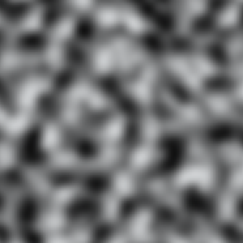
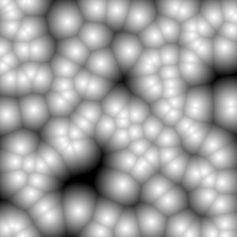

# Noise Textures

## Overview

TODO

## Basic Noise types

There are a few basic procedural noise types we will encounter in this project.

### Perlin Noise

[Perlin Noise](https://en.wikipedia.org/wiki/Perlin_noise) refers to
Perlin's original implementation of gradient noise, which aims to build a set
of (pseudo)random gradient vectors specifying how the noise value will change
over space, then smoothly connecting all of them. In practice, it is often
used to refer to any type of
[Simplex Noise](https://en.wikipedia.org/wiki/Simplex_noise), its successor.

To get a feel for working with Perlin noise, check out the
[Book Of Shaders chapter](https://thebookofshaders.com/11/) on it.

### Worley Noise

[Worley Noise](https://en.wikipedia.org/wiki/Worley_noise) is a cellular or
blobby noise, where the noise value is based on the distance to a set of
(pseudo)random 'seed' points.

To get a feel for working with Worley noise, check out the
[Book Of Shaders chapter](https://thebookofshaders.com/12/) on it.

### Curl Noise

Curl noise is a type of noise based on other noise values, usually Simplex noise.
Its purpose is to generate a noise whose components represent a
[divergence-free vector field](https://en.wikipedia.org/wiki/Solenoidal_vector_field).
What this means is that the noise represents the velocity of smoothly flowing
particles without any source or sink of particles. By placing particles at
various places and having their velocity follow the noise values wherever they
end up, you will end up with a smooth flow.

In practice, we do not keep track of these trajectories when using curl noise in
a shader, but by performing small looping displacements, we can still end up with
a convincing flow effect.

Check out this [blog post](http://petewerner.blogspot.com/2015/02/intro-to-curl-noise.html)
and the references therein for more details.

## Base Density Noise Texture

TODO

## Detail Density Noise Textures

TODO
